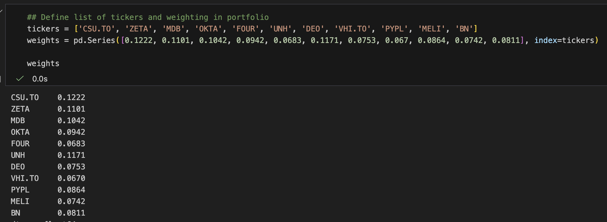

# Portfolio Returns Tear Sheet

'single_stock' notebook to generate performance metrics for a specific stock against a benchmark using `pyfolio`, handling timezone mismatches (e.g. LSE vs NYSE) automatically.

'portfolio_level' to consider portfolio as a whole.


## Setup (using uv)

```bash
uv venv
source .venv/bin/activate  # Windows: .venv\Scripts\activate
uv pip install yfinance pyfolio-reloaded jupyterlab ipykernel

```

## Analysis

- Open 'main' notebook
- Update stock ticker for stock of interest and benchmark (match yahoo finance ticker)
- Run analysis


## Current portfolio and weightings (Jan 2026)

